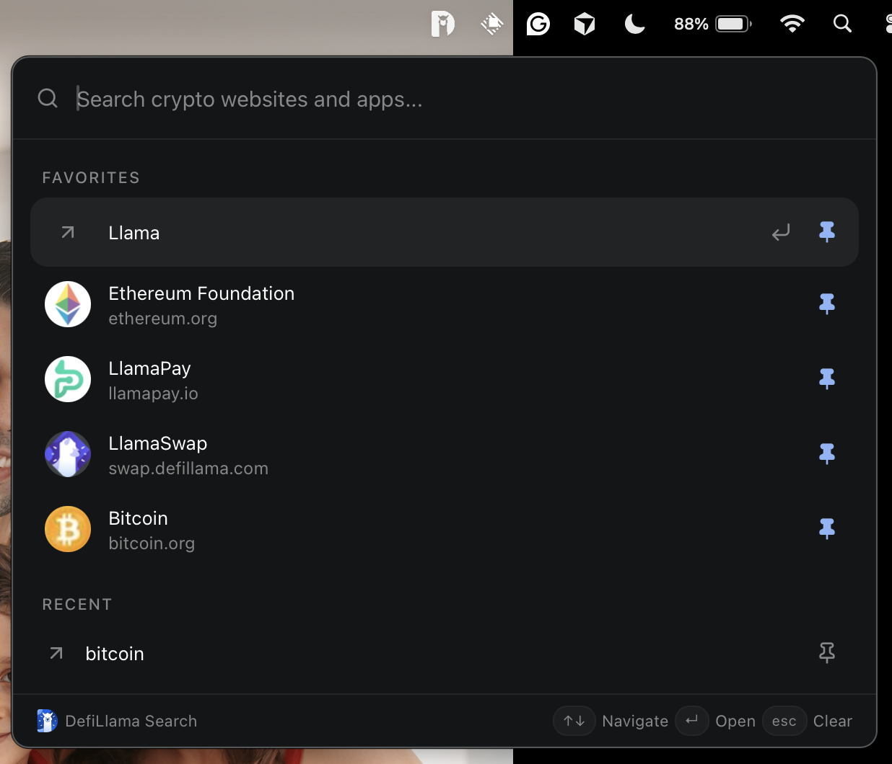
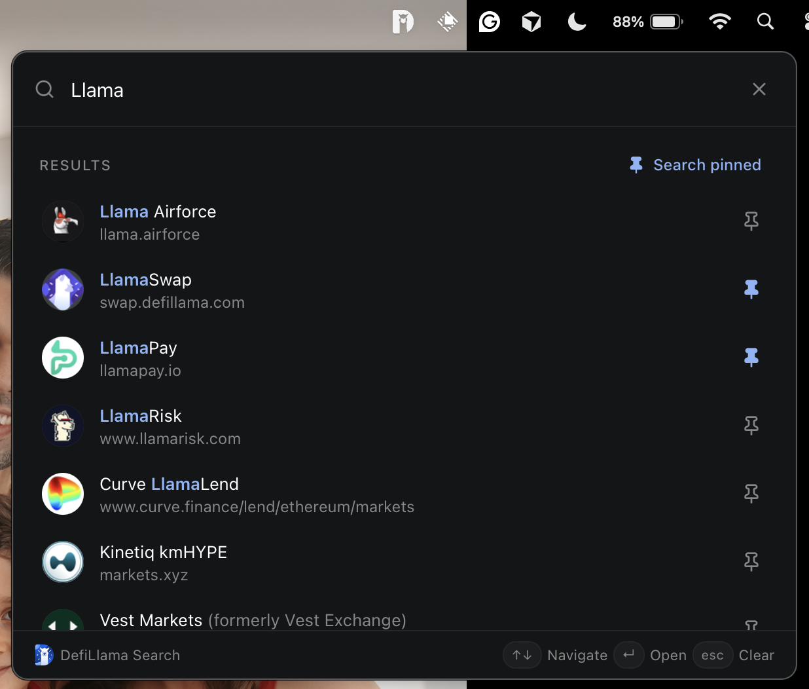
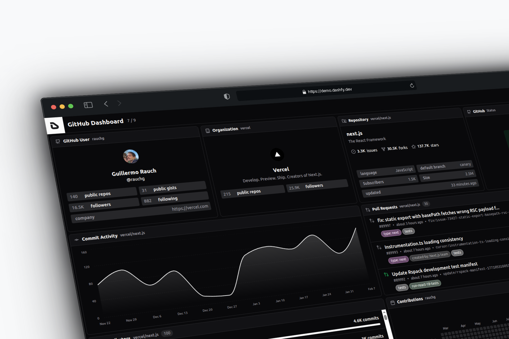
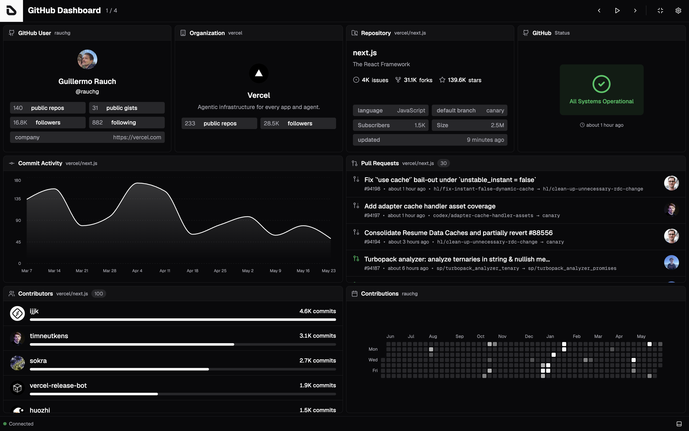
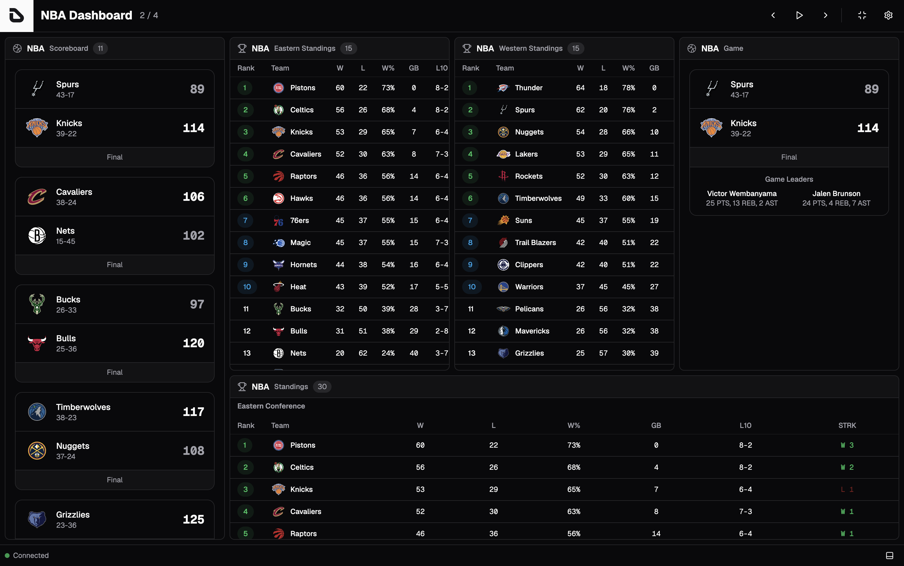
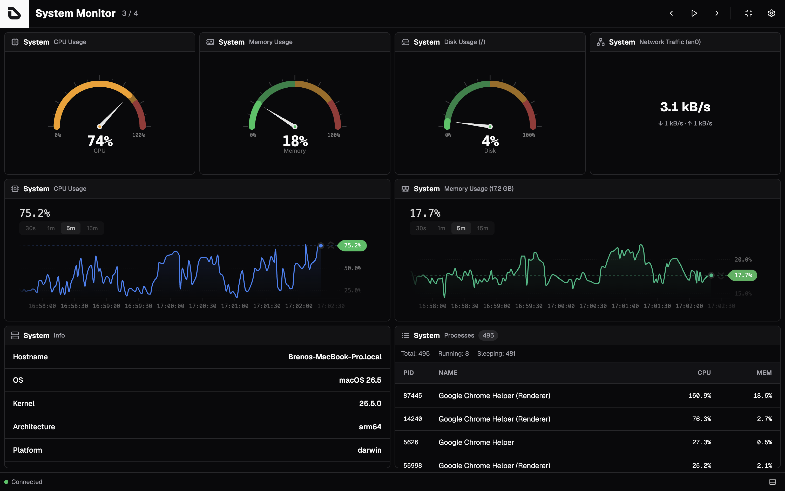
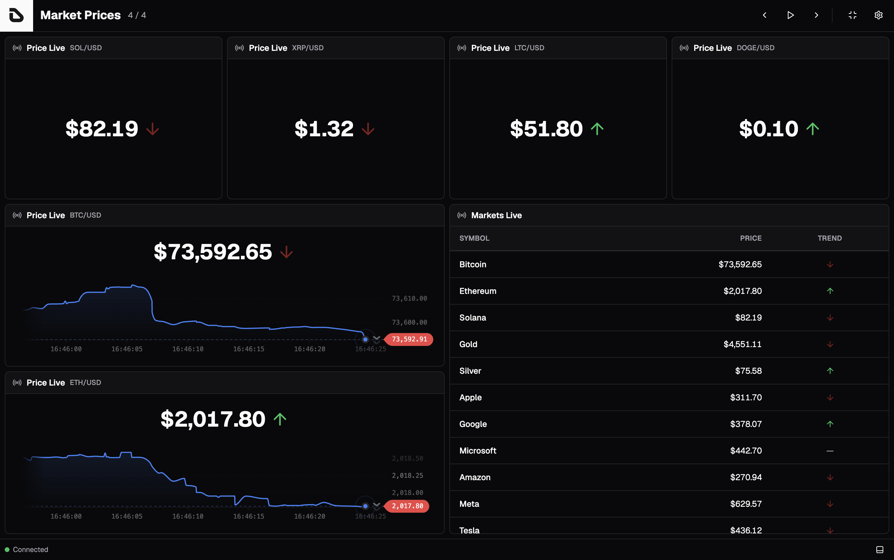
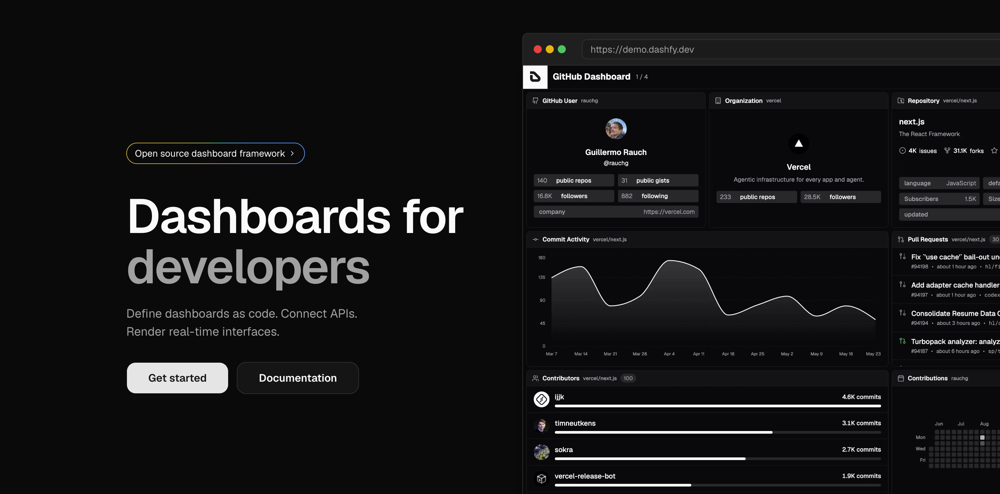
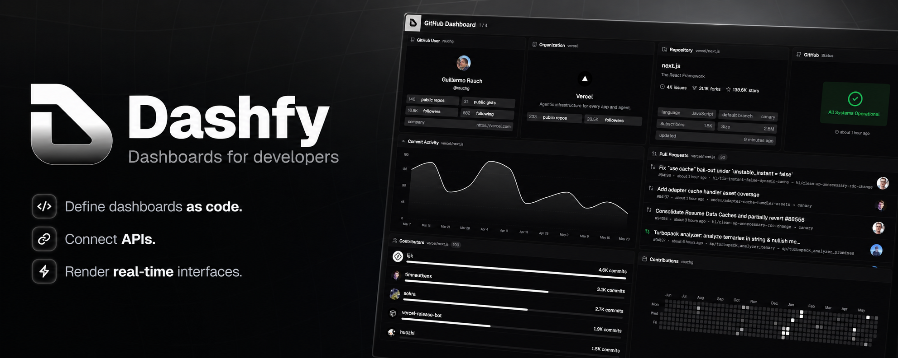

<h1 align="center">
  Breno Polanski - Portfolio
</h1>

  Indie hacker. Web3 developer. Open source enthusiast.

  
  
  
  

## <samp>// DEFILLAMA SEARCH</samp>

Unofficial macOS menu bar client · MIT · 2026

<table>
  <tr>
    <td width="50%" align="center">
      
    </td>
    <td width="50%" align="center">
      
    </td>
  </tr>
</table>

A tiny, keyboard-first tray app for [DefiLlama Search](https://search.defillama.com).
Press `⌘⇧L` (or click the menu bar icon) to open a compact popover, type a query,
and hit Enter to open the official project link in your default browser.

This is an independent open-source client. It is not developed, maintained, or
endorsed by DefiLlama.

### Tech stack

      

### Links

  

## <samp>// DASHFY</samp>

Dashboards for developers · AGPL-3.0 · 2025

  

<table>
  <tr>
    <td width="33%" align="center">
      
    </td>
    <td width="33%" align="center">
      
    </td>
    <td width="33%" align="center">
      
    </td>
  </tr>
  <tr>
    <td width="33%" align="center">
      
    </td>
    <td width="33%" align="center">
      
    </td>
    <td width="33%" align="center">
      
    </td>
  </tr>
</table>

An open-source framework I built to define dashboards as code. Connect APIs,
compose widgets through extensions, and render real-time interfaces — without
assembling dashboards by hand in a UI.

A CLI scaffolds projects, adds extensions, and audits setup. Dashboards are
declarative (TypeScript, JSON, or YAML) and stay versionable.

### Tech stack

     

### Links

   
